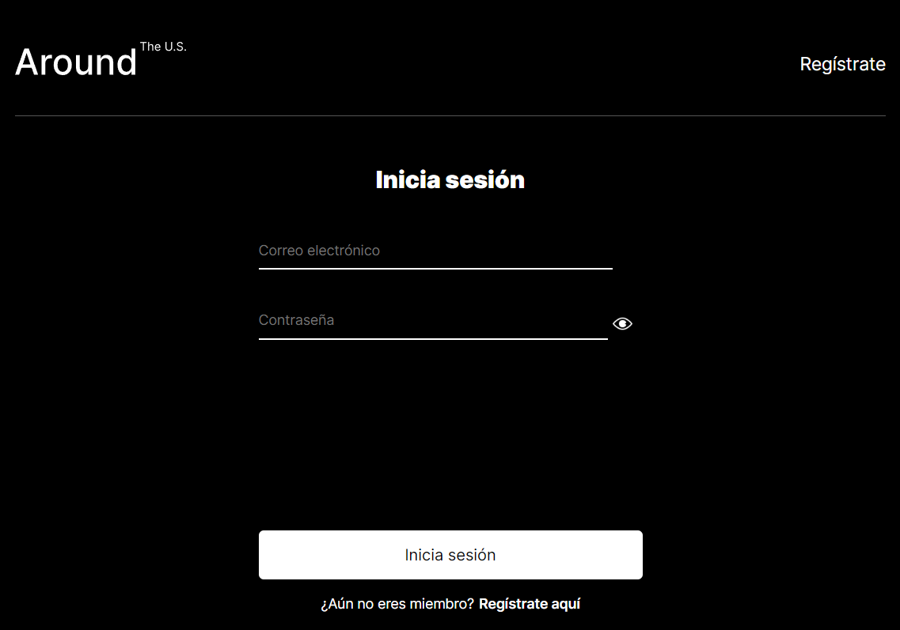
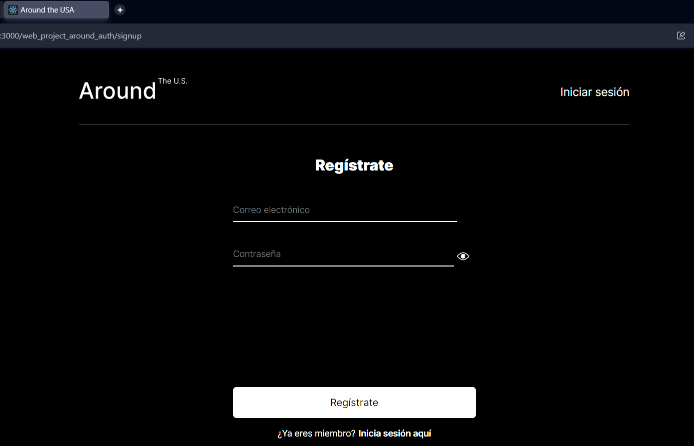
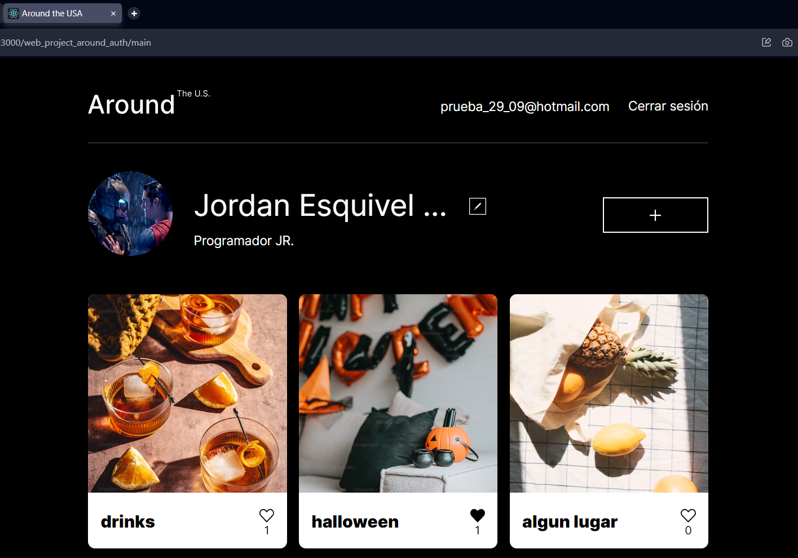
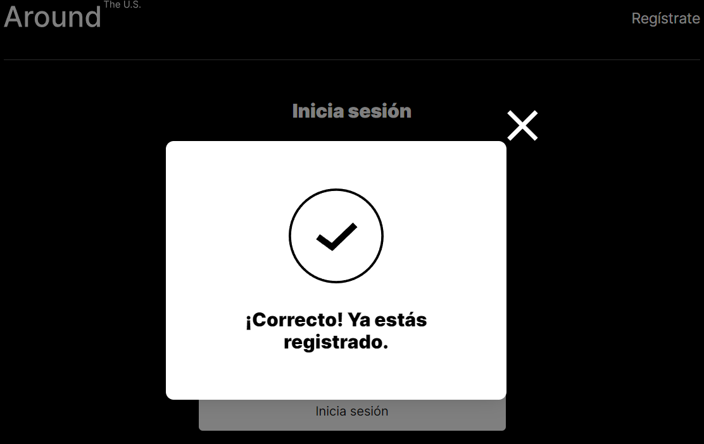
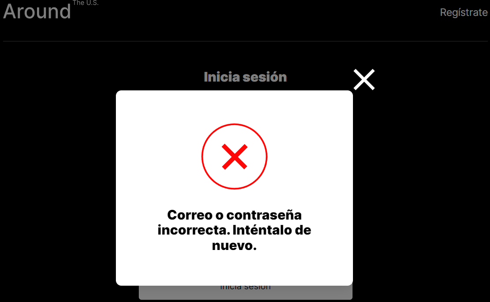
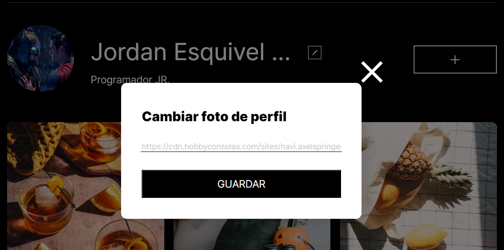
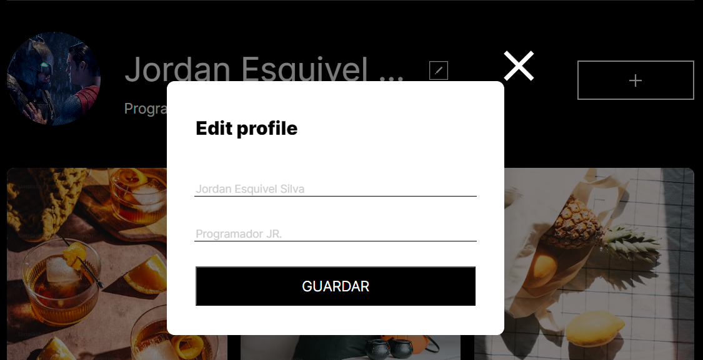
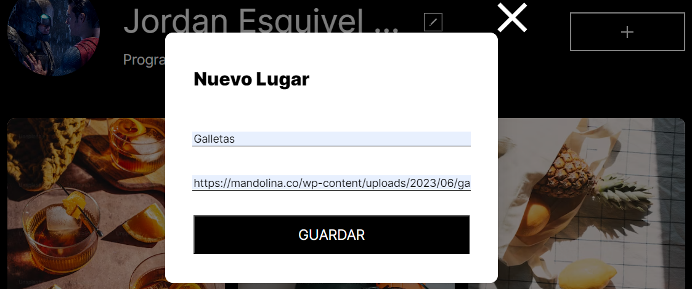
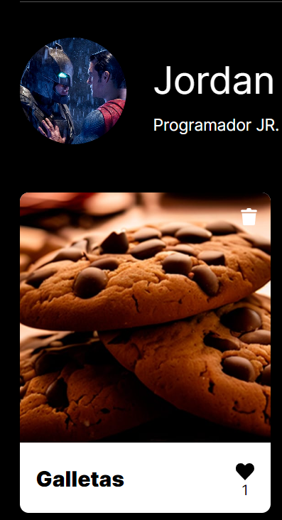
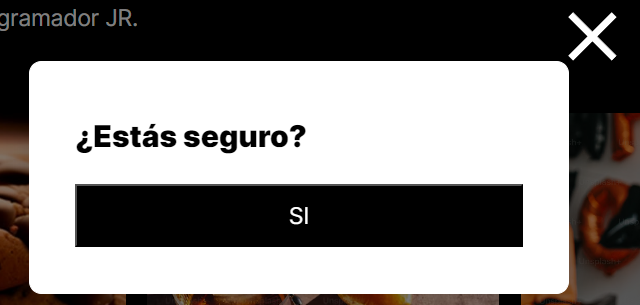

# Proyecto 15 - React y Autorización: Alrededor de los Estados Unidos

Este proyecto React presenta una colección de imágenes interesantes como paisajes, animales, comida y más. Los usuarios pueden explorar esta galería de imágenes y dar "Me gusta" a sus favoritas. Además, pueden ver detalles de las imágenes en un popup interactivo.

## Características del proyecto:

- Desarrollado con React para interactividad y fluidez.
- Muestra imágenes del servidor con componentes como Card e ImagePopup.
- Funcionalidad de "Me gusta" para imágenes.
- Popups interactivos con detalles de imágenes.
- Formularios emergentes para:
  - Editar perfiles.
  - Añadir lugares.
  - Iniciar sesión.
  - Registro de nuevos usuarios.
- Empaquetado y optimizado con Webpack, incluyendo transpilación y carga de recursos.

## Pasos de instalación

Sigue estos pasos para configurar y ejecutar el proyecto en tu máquina local:

1. **Clonar el repositorio**: Comienza clonando el repositorio de GitHub en tu máquina local utilizando el siguiente comando:

   git clone https://github.com/JordanEsquivelS/web_project_around_auth.git

2. **Instalar dependencias**: Abre una terminal en la carpeta raíz del proyecto y ejecuta el siguiente comando para instalar todas las dependencias necesarias:

   npm install

3. **Ejecutar en modo de desarrollo**: Una vez que todas las dependencias estén instaladas, puedes ejecutar el proyecto en modo de desarrollo con el siguiente comando:

   npm start

¡Con estos pasos, deberías tener el proyecto funcionando en tu máquina local .

## Demostración

### Página de Inicio de Sesión

- Ruta: `web_project_around_auth/signin`
- Descripción: Muestra el formulario para iniciar sesión.

  

### Formulario de Registro

- Ruta: `web_project_around_auth/signup`
- Descripción: Muestra el formulario para registrar un nuevo usuario.

  

### Vista Principal (Main)

- Ruta: `web_project_around_auth/main`
- Descripción: Acceso a la vista principal tras haber iniciado sesión correctamente.

  

### Tooltip de Registro

- Descripción: Tooltip que indica que el usuario ha sido registrado con éxito.

  

### Tooltip de Error en Inicio de Sesión

- Descripción: Tooltip que se muestra cuando el usuario o la contraseña son erróneos.

  

### Formulario para cambiar el avatar

- Descripción: Permite `actualizar el avatar` del usuario mediante una `URL`.

  

### Formulario para Actualizar Datos del Usuario

- Descripción: Permite actualizar datos específicos como el `nombre` y la `descripción` del usuario.

  

### Formulario para Agregar Nueva Tarjeta

- Descripción: Permite añadir una tarjeta nueva mediante un `título` y una `URL` de imagen.

  

### Funcionalidades de Like y Eliminación

- Descripción: Ofrece la opción de dar `like` a cualquier tarjeta y, en caso de ser el `creador`, muestra un `botón para eliminarla`.

  

### Formulario de Confirmación para Eliminar Tarjeta

- Descripción: Muestra un formulario para confirmar la `eliminación de una tarjeta`.

  

## Enlaces

- [Proyecto en GitHub Pages](https://jordanesquivels.github.io/web_project_around_auth/)

- [Proyecto en GitHub](https://github.com/JordanEsquivelS/web_project_around_auth/tree/main)
